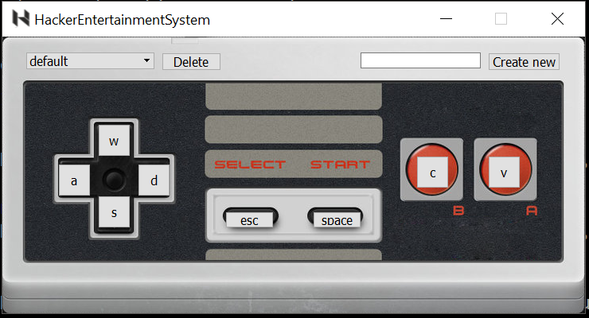

HES (Hacker Entertainment System)
=================================

### Setting up the controller
Simply program your arduino with the code on the Arduino folder

### Running the driver
Make sure you have Python 3.5 and PyQT 5.6 installed, as well as pip install Pillow, PyAutoGui and PySerial.

This project is structured as a Python Package so instead of running `python3 file.py` you should, from the HES folder, run `python3 -m Computer` (or `python -m Computer`, if python 3 is your default python installation)
> Note: The Computer/gui folder is set up as a package itself, so if you just want to test the GUI by itself you can run `python3 -m Computer.gui`

### Why a Python package?
Using a Python Package allows us to use absolute imports instead of relative ones, which can be useful in many situations.
You can read more about it here: https://docs.python.org/3/tutorial/modules.html#packages
